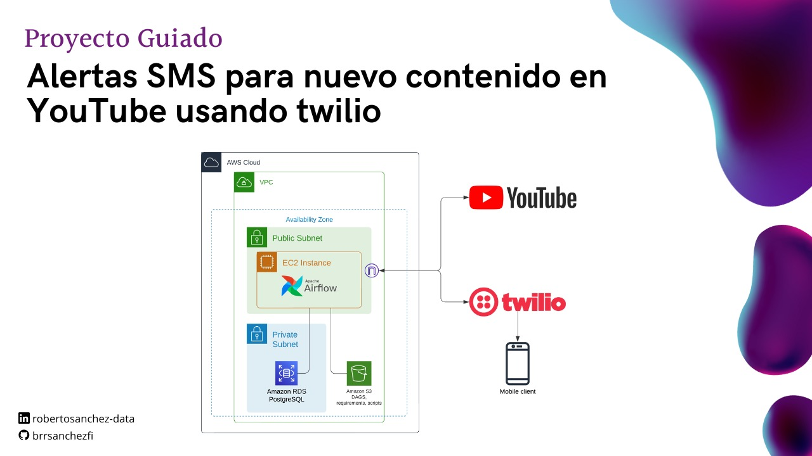

```markdown
# Proyecto Guiado: Alertas SMS con Airflow



<p align="center">
  
  
  
</p>


Este proyecto guiado te muestra cómo configurar un sistema de alertas SMS utilizando Apache Airflow, AWS, y la API de Twilio para notificar sobre nuevos videos en un canal de YouTube específico.

## Tecnologías Utilizadas

- **Apache Airflow**: Orquestación de tareas y programación de flujos de trabajo.
- **AWS (Amazon Web Services)**: Infraestructura en la nube con EC2, S3 y RDS PostgreSQL.
- **Twilio**: API para envío de mensajes SMS.
- **YouTube API**: Integración para monitorizar la actividad del canal.

## Configuración del Proyecto

### Paso 1: Clonar el Repositorio

```bash
git clone https://github.com/tu-usuario/nombre-repositorio.git
cd nombre-repositorio
```

### Paso 2: Configurar Variables de Entorno

Crea un archivo `.env` y añade las siguientes variables:

```env
YOUTUBE_API_KEY=TuClaveDeAPIdeYouTube
TWILIO_ACCOUNT_SID=TuSIDdeTwilio
TWILIO_AUTH_TOKEN=TuTokendeTwilio
AWS_ACCESS_KEY_ID=TuIDdeClaveDeAccesoAWS
AWS_SECRET_ACCESS_KEY=TuClaveSecretadeAccesoAWS
```

### Paso 3: Instalar Dependencias

```bash
pip install -r requirements.txt
```

### Paso 4: Ejecutar el Proyecto

```bash
python main.py
```

## Contribuciones

Si encuentras algún problema o tienes alguna mejora, ¡siéntete libre de contribuir! Abre un issue o realiza un pull request.

## Licencia

Este proyecto está bajo la [Licencia Apache 2.0](https://www.apache.org/licenses/LICENSE-2.0) - ver el archivo [LICENSE](LICENSE) para más detalles.
```
